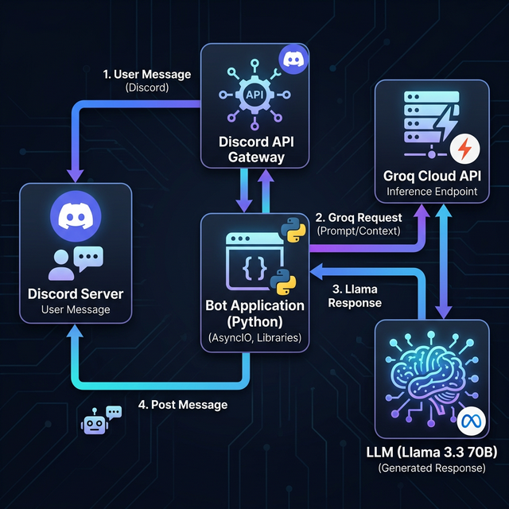
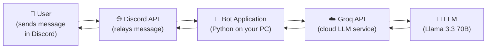
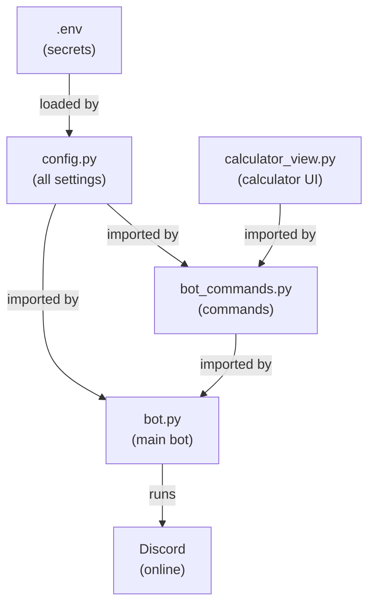
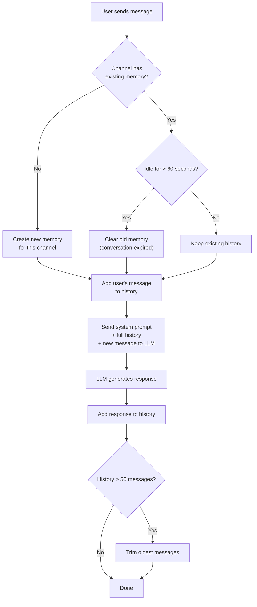

# 🤖 How to Build an AI Chatbot — A Beginner's Guide

> This guide uses the **PrawnKing Discord Bot** as a real-world example project to teach you the fundamentals of AI chatbots from the ground up.

---

## Table of Contents

1. [What is a Chatbot?](#1-what-is-a-chatbot)
2. [Understanding LLMs — The Brains Behind Modern Chatbots](#2-understanding-llms--the-brains-behind-modern-chatbots)
3. [Local vs API — Where Does the AI Live?](#3-local-vs-api--where-does-the-ai-live)
4. [High-Level Architecture — The Big Picture](#4-high-level-architecture--the-big-picture)
5. [Project Walkthrough — How PrawnKing Works](#5-project-walkthrough--how-prawnking-works)
6. [Summary & Next Steps](#6-summary--next-steps)

---

## 1. What is a Chatbot?

A **chatbot** is a program that can have a conversation with a human. You type something, and it types something back.

There are two generations of chatbots:

| Generation | How It Works | Example |
|---|---|---|
| **Rule-Based** (Old) | Follows hardcoded `if/else` rules. *"If user says 'hello', reply 'hi!'"* | Basic FAQ bots |
| **AI-Powered** (Modern) | Uses a **Large Language Model (LLM)** to *understand* and *generate* natural language | ChatGPT, this bot |

**Rule-based bots** are like vending machines — you press a button, you get a fixed result. **AI-powered bots** are more like talking to a real person who can understand context, handle typos, and even be creative.

> [!TIP]
> The PrawnKing bot in this project is an **AI-powered chatbot** — it sends your message to an LLM and returns the AI's response.

---

## 2. Understanding LLMs — The Brains Behind Modern Chatbots

### 2.1 What is an LLM?

**LLM** stands for **Large Language Model**. It's a type of AI that has been trained on massive amounts of text (books, websites, code, conversations) to learn the patterns and structure of human language.

Think of it like this:

```
Training Data (billions of words)
        ↓
   [ Training Process ] ← Months of computation on thousands of GPUs
        ↓
   Trained Model (the "brain")
        ↓
   You ask a question → Model predicts the best answer, word by word
```

### 2.2 How Does an LLM Actually Generate Text?

An LLM doesn't "think" like a human. Instead, it **predicts the next word** based on everything that came before it. It does this one word (technically, one *token*) at a time.

**Example:**

```
Input:  "The capital of France is"
                                    ↓
LLM predicts: "Paris" (because in its training data, "Paris" appeared 
               most often after "The capital of France is")
```

Here's the step-by-step process:

1. **Tokenization** — Your text is split into small pieces called **tokens** (roughly, words or sub-words).
   - `"Hello, how are you?"` → `["Hello", ",", " how", " are", " you", "?"]`
2. **Context Window** — The model looks at all the tokens together (its "context window") to understand the meaning.
3. **Prediction** — Using patterns learned during training, it assigns a probability to every possible next token.
4. **Selection** — One token is chosen (influenced by a **temperature** setting — more on this below).
5. **Repeat** — The selected token is added to the context, and the model predicts the next one. This loops until the response is complete.

### 2.3 Key Concepts You'll See in This Project

| Concept | What It Means | Where It Appears |
|---|---|---|
| **Model** | The specific LLM being used (e.g., `llama-3.3-70b-versatile`) | [config.py](config.py) |
| **Token** | A small chunk of text the model processes. ~1 token ≈ ¾ of a word | API request limits |
| **Temperature** | Controls randomness. `0.0` = very predictable, `1.0` = very creative | [config.py](config.py) (`GROQ_TEMPERATURE = 0.7`) |
| **Max Tokens** | The maximum number of tokens in the response | [config.py](config.py) (`GROQ_MAX_TOKENS = 1000`) |
| **System Prompt** | Instructions given to the LLM to define its personality and rules | [config.py](config.py) (`GROQ_SYSTEM_PROMPT`) |
| **Context / Memory** | Previous messages included so the model can "remember" the conversation | [bot.py](bot.py) (conversation memory system) |

### 2.4 What Does "Parameters" Mean? (e.g., 70B)

When you see a model name like `llama-3.3-70b-versatile`, the **70B** means it has **70 billion parameters**. Parameters are the internal "knobs" the model learned during training.

- **More parameters** → Generally smarter, but requires more computing power
- **Fewer parameters** → Faster but less capable

```
llama-3.3-70b-versatile     → 70 billion params  (smartest, slowest)
qwen/qwen3-32b             → 32 billion params  (balanced)
llama-3.1-8b-instant        → 8 billion params   (fast, simpler)
```

> [!NOTE]
> This project uses a **model hierarchy** — it tries the best model first, and if that one is busy (rate-limited), it falls back to the next one. See [Section 5.2](#52-the-llm-response-engine-botpy) for details.

---

## 3. Local vs API — Where Does the AI Live?

There are two fundamentally different ways to use an LLM in your application:

### 3.1 Running Locally

You download the model files onto your own computer and run inference (generate text) there.

| ✅ Pros | ❌ Cons |
|---|---|
| Free (no API costs) | Requires a powerful GPU (16GB+ VRAM for good models) |
| Full privacy — data never leaves your machine | Slower on consumer hardware |
| Works offline | You manage updates and model versions yourself |
| No rate limits | Setup is more complex |

**Tools:** [Ollama](https://ollama.com/), [LM Studio](https://lmstudio.ai/), [llama.cpp](https://github.com/ggerganov/llama.cpp)

### 3.2 Using a Cloud API

You send your prompt to a company's server over the internet, and they run the model for you.

| ✅ Pros | ❌ Cons |
|---|---|
| No GPU needed — works from any computer | Requires internet connection |
| Fast — runs on powerful server hardware | You're sending data to a third party |
| Easy to switch between models | Rate limits & usage quotas |
| Usually free tiers available | May have costs at scale |

**Providers:** [Groq](https://groq.com/), [OpenAI](https://openai.com/), [Anthropic](https://anthropic.com/), [Google AI](https://ai.google.dev/)

### 3.3 What Does This Project Use?

**This bot uses the Groq Cloud API** — specifically their endpoint at `https://api.groq.com/openai/v1/chat/completions`.

```
Your computer (runs bot.py)  ──HTTP request──▶  Groq's servers (runs the LLM)
                             ◀──HTTP response──
```

The bot itself doesn't need a GPU at all. It just needs an internet connection and a free API key from Groq.

> [!IMPORTANT]
> This project chose an **API-based approach** because:
> - A Discord bot typically runs on a server with no GPU
> - Groq offers a generous free tier
> - It lets you use large 70B+ parameter models that wouldn't fit on most personal computers

---

## 4. High-Level Architecture — The Big Picture

Before diving into code, let's understand how all the pieces fit together:



### 4.1 Architecture Overview



**The flow in plain English:**
1. A user types a message in Discord and **@mentions** the bot
2. Discord's servers send that message to your bot (via WebSocket)
3. Your Python bot receives the message, cleans it up, and prepends any conversation history
4. The bot sends a **POST request** to the Groq API with the full message list
5. The Groq API runs the LLM and returns a generated response
6. The bot sends that response back to Discord, which delivers it to the user

### 4.2 Project File Structure

```
dbot_project/
├── bot.py              ← 🏠 Main entry point: connects to Discord, handles messages, calls LLM
├── bot_commands.py     ← 🎮 Slash/prefix commands (help, roast, calculator, stop, restart)
├── calculator_view.py  ← 🖩 Interactive calculator UI with buttons
├── config.py           ← ⚙️ All settings: API keys, model list, system prompt, memory config
├── .env                ← 🔐 Secret tokens (NEVER commit this to Git!)
├── requirements.txt    ← 📦 Python package dependencies
└── .gitignore          ← 🚫 Tells Git which files NOT to track
```

### 4.3 How the Files Relate to Each Other



---

## 5. Project Walkthrough — How PrawnKing Works

Now let's go through each file and understand what the code does.

---

### 5.1 Configuration — [config.py](config.py)

This file is the **control center** of the bot. All settings live here so they're easy to find and change.

#### Loading Secrets from `.env`

```python
from dotenv import load_dotenv
load_dotenv()

DISCORD_BOT_TOKEN = os.getenv("DISCORD_BOT_TOKEN")
GROQ_API_KEY = os.getenv("GROQ_API_KEY")
```

**Why use `.env` files?** API keys and tokens are *secrets*. If you accidentally push them to GitHub, someone could steal them and misuse your bot or API account. The `.env` file stores secrets separately, and `.gitignore` ensures it's never committed.

#### The Model Hierarchy (Fallback System)

```python
GROQ_MODEL_HIERARCHY: List[str] = [
    "llama-3.3-70b-versatile",                     # Best quality
    "meta-llama/llama-4-scout-17b-16e-instruct",   # Llama 4
    "openai/gpt-oss-120b",                         # 120B params
    "qwen/qwen3-32b",                              # Good quality
    "llama-3.1-8b-instant",                        # Fast fallback
]
```

Free API tiers have **rate limits** (e.g., 100K tokens per day). If the best model is exhausted, the bot automatically tries the next one. This ensures the bot stays online even under heavy use.

#### The System Prompt — The Bot's "Personality Card"

```python
GROQ_SYSTEM_PROMPT = """You are PrawnKing, a Discord bot with a humorous personality.

Personality:
- Friendly and genuinely helpful
- Keep responses SHORT - maximum 5 sentences

Rules:
- ALWAYS respond in the same language the user is using
- Answer any questions helpfully, but avoid sensitive topics
- NEVER make up facts - if you're unsure about something, say so honestly
- Use Discord formatting when helpful (bold, code blocks, etc.)
"""
```

The **system prompt** is a special instruction sent to the LLM at the start of every conversation. It tells the AI *how to behave*. The LLM follows these instructions when generating every response. You can completely change the bot's personality just by editing this text!

> [!TIP]
> **Experimenting with the system prompt** is one of the easiest and most impactful things you can customize. Try making the bot more formal, give it a specific expertise, or make it roleplay as a character!

---

### 5.2 The LLM Response Engine — [bot.py](bot.py)

This is the main file that connects everything together. Let's break it down section by section.

#### Conversation Memory System

One of the key challenges with LLMs is that they have **no built-in memory** between API calls. Every request is independent — the model doesn't inherently remember what you said 30 seconds ago.

This bot solves this by maintaining a **per-channel conversation history** in a Python dictionary:

```python
# Storage structure
conversation_memory: Dict[int, dict] = {}
# Example of what's stored:
# {
#   123456789: {                              ← channel ID
#     "messages": [
#       {"role": "user", "content": "[Alice]: What's Python?"},
#       {"role": "assistant", "content": "Python is a programming language..."},
#       {"role": "user", "content": "[Bob]: Can you show an example?"},
#     ],
#     "last_active": 1709510400.0             ← Unix timestamp
#   }
# }
```

**How the memory works:**



**Key design decisions:**
- **Per-channel memory** — Each Discord channel has its own separate conversation. Channel A won't leak context into Channel B.
- **Idle timeout (60 seconds)** — If nobody talks for 60 seconds, the memory resets. This prevents stale context from confusing the bot.
- **Max 50 messages** — Prevents the memory from growing too large (which would cost more tokens and could exceed the LLM's context window).
- **Username attribution** — Messages include `[Username]:` so the LLM knows who said what in a group chat.

#### The LLM API Call — The Core of the Bot

This is where the "AI magic" happens. The `generate_llm_response` function builds a request and sends it to Groq:

```python
def generate_llm_response(channel_id, prompt, username) -> str:
    # 1. Get existing conversation history
    history = get_channel_memory(channel_id)
    
    # 2. Build the messages list for the API
    messages = [{"role": "system", "content": GROQ_SYSTEM_PROMPT}]  # Personality
    messages.extend(history)                                         # Past messages
    messages.append({"role": "user", "content": f"[{username}]: {prompt}"})  # New message
    
    # 3. Try each model in order
    for model in GROQ_MODEL_HIERARCHY:
        response = requests.post(
            GROQ_API_URL,
            headers={"Authorization": f"Bearer {GROQ_API_KEY}"},
            json={
                "model": model,
                "messages": messages,
                "temperature": GROQ_TEMPERATURE,  # 0.7 = slightly creative
                "max_tokens": GROQ_MAX_TOKENS,     # 1000 max
            },
        )
        # If rate limited (429), try next model
        # If success, return the response
```

**The API message format explained:**

Every message sent to the API has a `role`:

| Role | Who | Example |
|---|---|---|
| `system` | The developer (you!) | *"You are PrawnKing, a friendly bot..."* |
| `user` | The human chatting | *"What's the weather like?"* |
| `assistant` | The AI's previous responses | *"I can't check weather, but it's always sunny in my circuits!"* |

The model reads all messages in order and generates the next `assistant` response.

#### Message Handling — From Discord to AI and Back

```python
@bot.event
async def on_message(message: discord.Message):
    # 1. Ignore our own messages (prevent infinite loops!)
    if message.author == bot.user:
        return

    # 2. Only respond if: correct channel AND bot is @mentioned AND not a command
    if (message.channel.id in ALLOWED_CHANNEL_IDS 
        and bot.user.mentioned_in(message)
        and not message.content.startswith(BOT_PREFIX)):
        
        # 3. Remove the @mention from the text
        cleaned_message = message.content.replace(f"<@{bot.user.id}>", "").strip()
        
        # 4. Check if user is replying to a previous message (adds context)
        # ...
        
        # 5. Show "typing..." indicator while generating
        async with message.channel.typing():
            response = generate_llm_response(...)
        
        # 6. Split long responses (Discord's 2000 char limit)
        if len(response) > 2000:
            parts = [response[i:i+2000] for i in range(0, len(response), 2000)]
```

> [!NOTE]
> **Why `async`?** Discord bots use **asynchronous programming** — the bot can handle multiple users' messages at the same time without blocking. The `await` keyword pauses one task while waiting for a response, freeing up resources to handle others.

---

### 5.3 Bot Commands — [bot_commands.py](bot_commands.py)

Commands are structured actions users trigger with a prefix (`>>>`). This file uses Discord.py's **Cog** system.

#### What is a Cog?

A **Cog** is a way to organize related commands into a single class. Think of it like a "plugin" for your bot.

```python
class BotCommands(commands.Cog):          # ← The plugin class
    def __init__(self, bot: commands.Bot):
        self.bot = bot                     # ← Store reference to the bot

    @commands.command()                    # ← This decorator turns a method into a command
    async def calculator(self, ctx):
        # ...
```

The Cog is loaded in `bot.py` when the bot starts:

```python
@bot.event
async def on_ready():
    await bot.add_cog(BotCommands(bot))   # ← Register the plugin
```

#### Command Breakdown

| Command | Prefix Usage | What It Does | Access |
|---|---|---|---|
| `>>>help` | `>>>help` | Shows an embedded help card with all commands and features | Everyone |
| `>>>calculator` | `>>>calculator` | Opens an interactive calculator with clickable buttons | Everyone |
| `>>>roast @User` | `>>>roast @User` | Uses the LLM to generate a savage (but clean) roast of the tagged user | Everyone |
| `>>>stop` | `>>>stop` | Shuts down the bot | Owner only |
| `>>>restart` | `>>>restart` | Restarts the bot by spawning a new process | Owner only |

#### The Roast Command — A Mini LLM Application

The `>>>roast` command is an excellent example of using an LLM for a specific task:

```python
@commands.command()
async def roast(self, ctx, target: discord.Member = None):
    # Build a very specific prompt for the LLM
    prompt = (
        f"Roast the user named '{target.display_name}' as hard as possible. "
        "Rules you MUST follow:\n"
        "- Be SAVAGE and BRUTAL, but as friendly as possible.\n"
        "- Absolutely NO bad words, slurs, or profanity. Clean language only.\n"
        "- NO puns. NO wordplay. NO dad jokes.\n"
        # ...
    )
    
    # Call the LLM API directly (no conversation memory needed for this)
    response = requests.post(GROQ_API_URL, json={
        "model": model,
        "messages": [{"role": "user", "content": prompt}],
        "temperature": 1.0,   # ← Maximum creativity for funnier roasts!
        "max_tokens": 150,    # ← Keep it short and punchy
    })
```

**Notice how `temperature` is set to `1.0` here** (vs. `0.7` for general chat). Higher temperature = more creative and unpredictable responses, which is perfect for comedy!

#### Owner-Only Commands & Permissions

```python
@commands.command()
@commands.is_owner()         # ← Only the bot owner can use this
async def stop(self, ctx):
    await self.bot.close()
```

The `@commands.is_owner()` decorator restricts a command to the Discord account that created the bot. If someone else tries it, an error handler sends a "no permission" message:

```python
@stop.error
async def owner_command_error(self, ctx, error):
    if isinstance(error, commands.NotOwner):
        await ctx.send("You do not have permission to use this command.")
```

---

### 5.4 Interactive Calculator — [calculator_view.py](calculator_view.py)

This file demonstrates something beyond AI — an **interactive UI component** inside Discord using buttons.

#### How Discord Views Work

Discord's **View** system lets you attach interactive buttons to messages. When a user clicks a button, your bot receives a callback event.

```
  ┌─────────────────────────────┐
  │  ``` 3+5 ```                │   ← The message content (displays the input/result)
  │                             │
  │  [7] [8] [9] [/] [⌫]       │   ← Row 1 of buttons
  │  [4] [5] [6] [*] [C]       │   ← Row 2 of buttons
  │  [1] [2] [3] [-] [(]       │   ← Row 3 of buttons
  │  [0] [.] [=] [+] [)]       │   ← Row 4 of buttons
  │  [Close]                    │   ← Row 5
  └─────────────────────────────┘
```

#### Safe Math Evaluation

The calculator needs to evaluate expressions like `3+5*2`. Using Python's built-in `eval()` would be **extremely dangerous** — a malicious user could run arbitrary code! Instead, this project uses a **safe evaluator** based on Python's `ast` (Abstract Syntax Tree) module:

```python
SAFE_OPERATORS = {
    ast.Add: operator.add,      # +
    ast.Sub: operator.sub,      # -
    ast.Mult: operator.mul,     # *
    ast.Div: operator.truediv,  # /
}

def safe_eval(expression: str):
    tree = ast.parse(expression, mode='eval')   # Parse into syntax tree
    return _eval_node(tree.body)                 # Only evaluate safe nodes
```

**How it works:**
1. Python's `ast.parse()` converts the string `"3+5*2"` into a tree structure
2. The `_eval_node()` function walks the tree and only allows: numbers, `+`, `-`, `*`, `/`
3. Any other operation (e.g., function calls, imports) raises an error

This means a user can type `3+5*2` and get `13`, but they **cannot** type `__import__('os').system('rm -rf /')` — the safe evaluator will reject it.

> [!CAUTION]
> **Never use `eval()` on user input!** It can execute arbitrary Python code. Always use a safe alternative like the AST-based approach shown here.

#### Button Callback Pattern

Each button uses a **callback factory pattern** — a function that creates a function:

```python
def _create_callback(self, label: str):
    async def callback(interaction: discord.Interaction):
        await self._handle_button(interaction, label)
    return callback
```

This is necessary because all buttons need their own separate callback function, but they all share the same logic. The factory "remembers" each button's `label` through a Python concept called a **closure**.

---

### 5.5 Secrets & Dependencies

#### [.env](.env) — Keeping Secrets Safe

```env
GROQ_API_KEY="gsk_your_key_here"
DISCORD_BOT_TOKEN="your_token_here"
```

> [!CAUTION]
> **NEVER commit your `.env` file to GitHub!** If someone gets your Discord bot token, they can control your bot. If they get your API key, they can use your quota. Always add `.env` to `.gitignore`.

#### [requirements.txt](requirements.txt) — What You Need to Install

```
discord.py>=2.0.0      # Discord bot framework
python-dotenv>=1.0.0   # Loads .env files
requests>=2.28.0       # Makes HTTP API calls
```

Install everything with: `pip install -r requirements.txt`

---

## 6. Summary & Next Steps

### What You've Learned

| Topic | Key Takeaway |
|---|---|
| **Chatbots** | Programs that simulate conversation — modern ones use AI (LLMs) |
| **LLMs** | Predict the next word using patterns learned from billions of words of training data |
| **Tokens** | Small text chunks that LLMs process; also determine API costs |
| **Temperature** | Controls creativity: `0.0` = focused, `1.0` = creative |
| **System Prompt** | Instructions defining the AI's personality and rules |
| **Local vs API** | Local = needs GPU, free; API = needs internet, easy to set up |
| **Conversation Memory** | LLMs don't remember by default; you must send previous messages each time |
| **Model Fallback** | Try the best model first; if rate-limited, fall back to the next |
| **Cogs** | Discord.py's plugin system for organizing commands |
| **Safe Eval** | Never use `eval()` on user input; use AST-based safe evaluation |

### Where to Go From Here

1. **Experiment with the system prompt** — Change the bot's personality and see how responses change
2. **Add new commands** — Create your own commands in `bot_commands.py` using the Cog pattern
3. **Try a different API provider** — Swap Groq for OpenAI or Anthropic (the message format is similar)
4. **Try running a model locally** — Install [Ollama](https://ollama.com/) and point the bot at `http://localhost:11434` instead
5. **Add slash commands** — Discord's newer interaction system that provides auto-complete
6. **Add a database** — Replace the in-memory dictionary with SQLite for persistent memory

> [!TIP]
> The best way to learn is to **break things**! Change a setting, see what happens. Add a new command. Try a different model. The bot is your playground. 🦐
